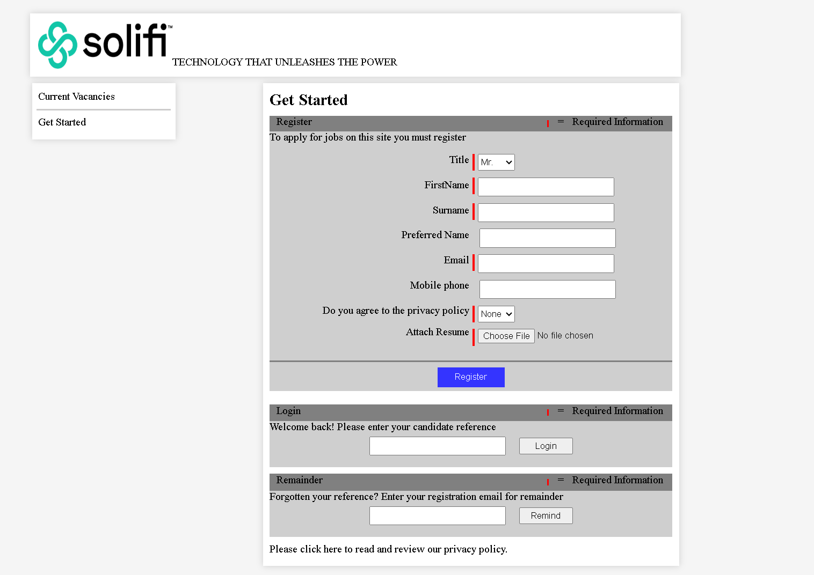

<a id="readme-top"></a>

[![LinkedIn][linkedin-shield]][linkedin-url]


<!-- PROJECT LOGO -->
<br />
<div align="center">
  <a href="https://github.com/Chand-007/ApplicationForm">
    
  </a>

<h3 align="center">Job Application Form UI</h3>

  <p align="center">
    This project is made with ReactJS.This project consists of UI for a Job Application form
    <br />
    <a href="https://github.com/Chand-007/ApplicationForm"><strong>Explore Repository »</strong></a>
    <br />
  </p>
</div>


<!-- TABLE OF CONTENTS -->
<details>
  <summary>Table of Contents</summary>
  <ol>
    <li>
      <a href="#about-the-project">About The Project</a>
      <ul>
        <li><a href="#built-with">Built With</a></li>
      </ul>
    </li>
    <li>
      <a href="#getting-started">Getting Started</a>
      <ul>
        <li><a href="#prerequisites">Prerequisites</a></li>
        <li><a href="#installation">Installation</a></li>
      </ul>
    </li>
    <li> Contribution and contact
    <li><a href="#contributing">Contributing</a></li>
    <li><a href="#contact">Contact</a></li>
    </li>
  </ol>
</details>


<!-- ABOUT THE PROJECT -->
## About The Project

![Product Name Screen Shot][product-screenshot]

Built a responsive and dynamic job application form using ReactJS. Implemented user-friendly UI components. Styled using CSS Modules and integrated accessibility best practices.

<p align="right">(<a href="#readme-top">back to top</a>)</p>


### Built With

* [![React][React.js]][React-url]

<p align="right">(<a href="#readme-top">back to top</a>)</p>


<!-- GETTING STARTED -->
## Getting Started

To get a local copy up and running follow these simple example steps.

### Prerequisites


* npm
  ```sh
  npm install npm@latest -g
  ```

### Installation


#### Running Application in Docker Containers
1. Clone the repo
```sh
   git clone https://github.com/Chand-007/ApplicationForm
```
2. Change Directory
```sh
   cd ApplicationForm
```
3. Build Docker image
```sh
   docker build -t <name-of-image> .
```

substitute name of image you want to give above in <name-of-image>

4. Run Docker container with above built image
```sh
     docker run -d -p 5000:5000 --name <name-of-container> <name-of-image>
```

substitute name of container as your wish and enter name of image built in previous step (step - 4)

#### Running Application in Local

1. Clone the repo
   ```sh
   git clone https://github.com/Chand-007/ApplicationForm
   ```
2. Change Directory
   ```sh
   cd ApplicationForm
   ```
3. Install NPM packages
   ```sh
   npm install
   ```
4. Start Application
   ```sh
   npm run dev
   ```

<p align="right">(<a href="#readme-top">back to top</a>)</p>


<!-- CONTRIBUTING -->
## Contributing

please fork the repo and create a pull request. You can also simply open an issue with the tag "enhancement".


1. Fork the Project
2. Create your Feature Branch (`git checkout -b feature/AmazingFeature`)
3. Commit your Changes (`git commit -m 'Add some AmazingFeature'`)
4. Push to the Branch (`git push origin feature/AmazingFeature`)
5. Open a Pull Request

<p align="right">(<a href="#readme-top">back to top</a>)</p>

<!-- CONTACT -->

Project Link: [https://github.com/Chand-007/ApplicationForm.git](https://github.com/Chand-007/ApplicationForm.git)

<p align="right">(<a href="#readme-top">back to top</a>)</p>


[linkedin-shield]: https://img.shields.io/badge/-LinkedIn-black.svg?style=for-the-badge&logo=linkedin&colorB=555
[linkedin-url]: https://www.linkedin.com/in/getlabc
[product-screenshot]: solifi-1-pic.PNG
[React.js]: https://img.shields.io/badge/React-20232A?style=for-the-badge&logo=react&logoColor=61DAFB
[React-url]: https://reactjs.org/
